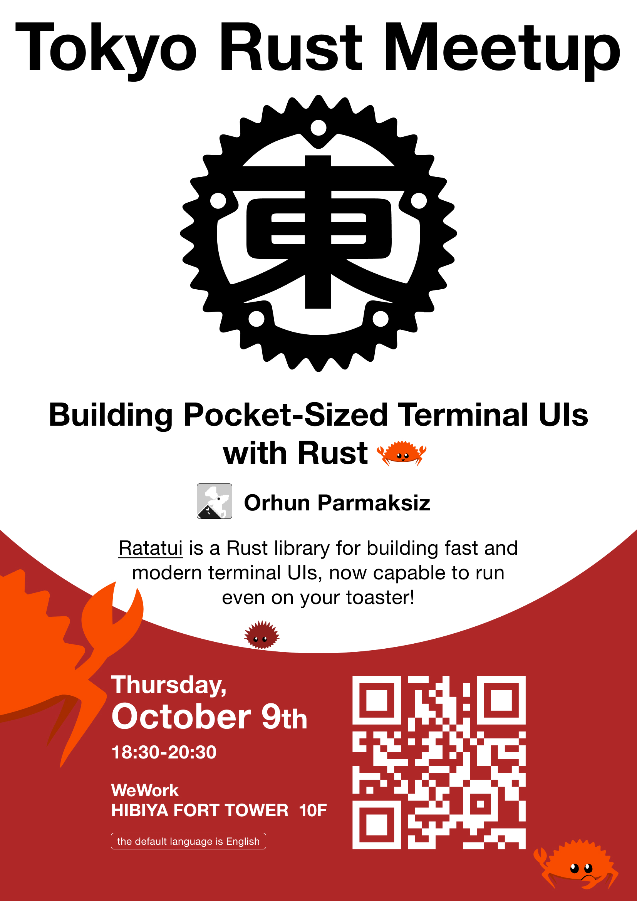

<p align="center">

</p>

# Building Pocket-Sized Terminal UIs with Rust 🦀👨‍🍳

> Ratatui is a Rust library for building fast and modern terminal UIs, now capable to run even on your toaster!
>
> In this talk, Orhun Parmaksiz (open source developer and maintainer of Ratatui) will take us on a whirlwind tour of what Ratatui is capable of, from system tools and games to musical instruments. After that, we will jump into a hands-on workshop where we will build a TUI application from scratch and use Ratatui's newly added no_std support to run it on a tiny display that fits in your pocket! (ESP32 T-Display)
>
> We will also host a fun mini-competition where the top 3 workshop projects, as voted by participants, will get to keep the device.
>
> Join us for a session packed with awesome terminal UIs and hands-on hacking with embedded Rust!

> [!NOTE]  
> See [this repository](https://github.com/orhun/embedded-ratatui-workshop) for the workshop materials.

## Presentation

This repository also includes a talk about Ratatui and embedded Rust.

To start the presentation, first install [presenterm](https://github.com/mfontanini/presenterm):

```bash
cargo install presenterm
```

Then simply run:

```bash
presenterm presentation.md -X -c config/presenterm.yml -p
```

> [!IMPORTANT]  
> It is recommended to use [wezterm](https://github.com/wez/wezterm) for good image rendering. The configuration file can be found in [`config/wezterm.lua`](./config/wezterm.lua).

> [!TIP]  
> Run the [`present.sh`](./present.sh) script to present with the recommended tools and configuration.

## Show and Tell

Join the [Ratatui Discord](https://discord.gg/pMCEU9hNEj) and share your creations with the other terminal chefs!

If you have any questions or need help, feel free to ask there as well!

## License

Copyright © 2025, [Orhun Parmaksız](https://github.com/orhun)

Licensed under [The MIT License](./LICENSE)

🦀 ノ( º \_ º ノ) - respect crables!
