---
theme:
  name: tokyonight-storm
  override:
    footer:
      style: template
      left: "@orhun.dev"
      right: "Tokyo Rust Meetup"
---

<!-- new_lines: 1 -->


<!-- no_footer -->

<!-- end_slide -->

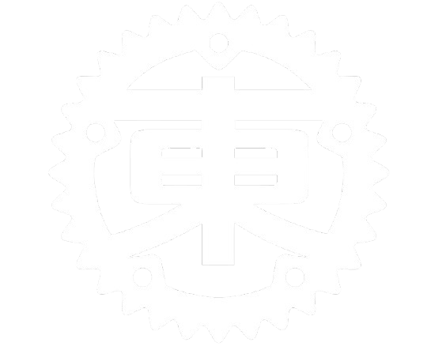

<!-- alignment: center -->

**Rustでポケットサイズのターミナル UIを作る** 🦀

_Rust Tokyo Meetup 🇯🇵_

---

**Orhun Parmaksız -  パルマクシズ オルフン**

`@orhun.dev` | `@ratatui.rs`

<!-- no_footer -->

<!-- end_slide -->

<!-- column_layout: [1, 1] -->

<!-- column: 0 -->


<!-- column: 1 -->

<!-- new_lines: 2 -->

# **Orhun Parmaksız**

🇹🇷 **アンカラ、トルコ**在住のクリエイター

🦀 _オープンソース、Rust、そしてターミナル!_

🐭 **Ratatui**、**Ratzilla**、**git-cliff** など...

📦 **Arch Linux** (btw)

---

`https://github.com/orhun`  
`https://youtube.com/@orhundev`

<!-- end_slide -->

<!-- alignment: center -->

<!-- new_lines: 3 -->

**ネズミを想像してください。**

<!-- pause -->

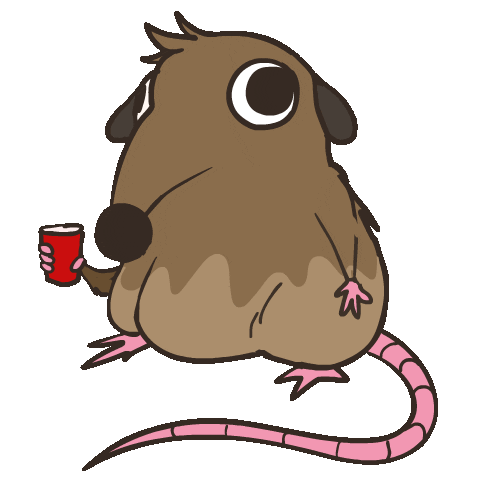

<!-- pause -->

_ネズミはMP3をダウンロードしたい_

<!-- pause -->

_ネズミはytmp3downloader.ccに移動する_

<!-- no_footer -->

<!-- end_slide -->


<!-- pause -->

<!-- jump_to_middle -->


<!-- alignment: center -->

<!-- no_footer -->

<!-- end_slide -->

<!-- no_footer -->

<!-- alignment: center -->

<!-- new_lines: 3 -->

**ネズミを想像してください（もう一度）**

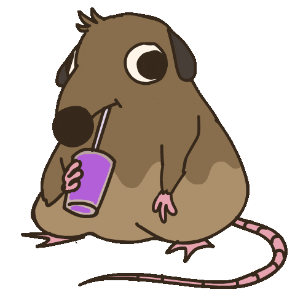

<!-- pause -->

_ネズミはcheese.txtを探している_

<!-- pause -->

_ネズミはファイル検索を使う_

<!-- end_slide -->

<!-- no_footer -->


<!-- pause -->

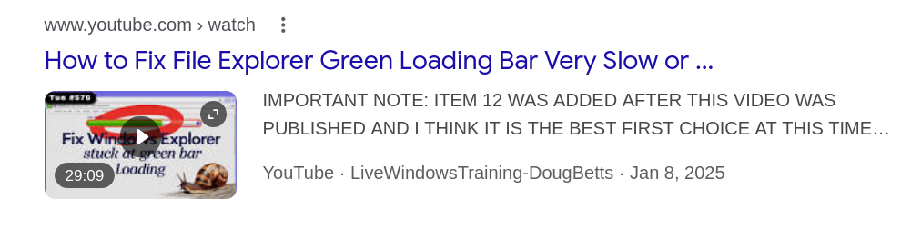

<!-- pause -->


<!-- pause -->

<!-- jump_to_middle -->

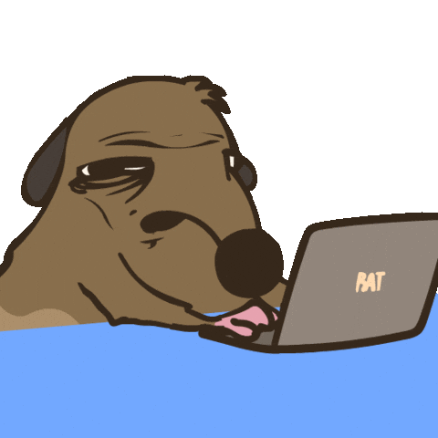

<!-- end_slide -->

<!-- alignment: center -->

<!-- new_lines: 3 -->

<!-- no_footer -->

**ネズミを想像してください（ごめんね）**

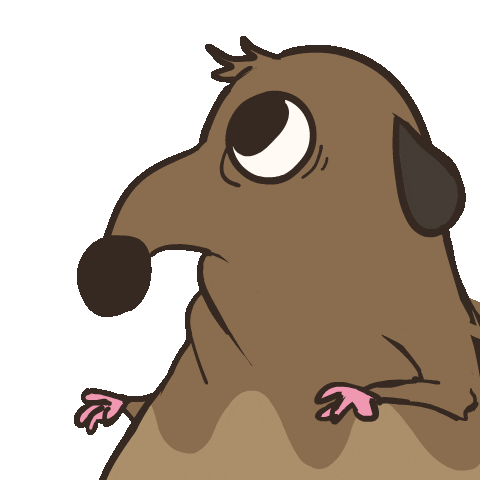

<!-- pause -->

_ネズミはネットワークトラフィックを監視したい_

<!-- pause -->

_ネズミはGUIツールを起動する_

<!-- pause -->

<!-- end_slide -->

<!-- no_footer -->


<!-- end_slide -->


<!-- alignment: center -->

_ネズミは爆発した。_

<!-- no_footer -->

<!-- end_slide -->

# 解決策は？

<!-- pause -->

ターミナルです。

<!-- pause -->

```bash
$ yt-dlp -f bestaudio --extract-audio --audio-format mp3
```

<!-- pause -->

```bash +exec +acquire_terminal
ig 'fn main' /home/orhun/gh/
```

<!-- pause -->

```sh +exec +acquire_terminal
sudo oryx -i wlp3s0
```

<!-- end_slide -->


<!-- alignment: center -->

**https://ratatui.rs**

<!-- pause -->

---

> Ratatuiは、ターミナルユーザーインターフェース（TUI）を料理するためのRustライブラリです。

- `2023年`から存在（`tui-rs`からのフォーク）

- `250人以上`の貢献者、数百のアプリ、`800万回以上`のクレートダウンロード

- `tokio-console`、`yazi`、`dioxus-cli`、`atuin`、`gitui`等

- `Netflix`、`OpenAI`、`OVHcloud`など多くの企業で使用

<!-- end_slide -->

```bash +exec +acquire_terminal
cargo run --manifest-path ratatui/examples/apps/demo2/Cargo.toml
```

<!-- end_slide -->

# atac

<!-- alignment: center -->

ターミナル用のPostmanのようなAPIクライアント


[](https://github.com/Julien-cpsn/ATAC)

<!-- end_slide -->

# doxx

<!-- alignment: center -->

ターミナルで.docxファイルを表示

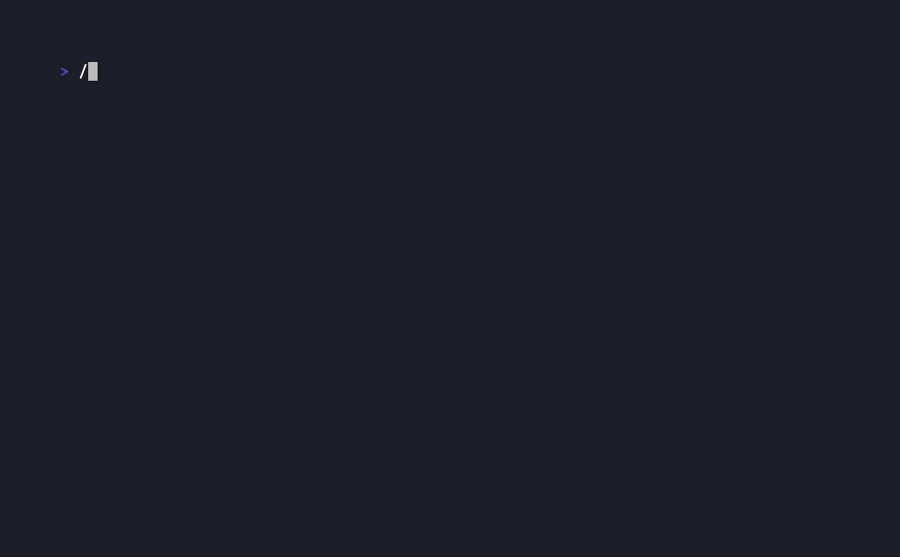

[](https://github.com/bgreenwell/doxx)

<!-- end_slide -->

# rebels-in-the-sky

<!-- alignment: center -->

銀河中でバスケットボールをやる宇宙海賊

[](https://github.com/ricott1/rebels-in-the-sky)

---

<!-- pause -->

```bash +exec +acquire_terminal
rebels-in-the-sky
```

<!-- end_slide -->

# sharad-ratatui

<!-- alignment: center -->

テキストベースのシャドウランRPG

[](https://github.com/ProHaller/sharad_ratatui)

---

<!-- pause -->

```bash +exec
mpv assets/sharad.mp4 > /dev/null 2>&1
```

<!-- end_slide -->

# grainiac

<!-- alignment: center -->

グラニュラーサンプラーのTUI

[](https://github.com/christian-grothe/grainiac)

---

<!-- pause -->

```bash +exec
mpv assets/grainiac.mp4 > /dev/null 2>&1
```

<!-- pause -->

```bash +exec
handlr open https://www.youtube.com/watch?v=XzJnMVo1ZkM
```

<!-- end_slide -->

# tachyonfx

<!-- alignment: center -->

TUIのアプリにシェーダーのような効果を追加

[](https://github.com/junkdog/tachyonfx)

---

<!-- pause -->

```bash +exec +acquire_terminal
exabind
```

<!-- end_slide -->

<!-- alignment: center -->

<!-- new_lines: 2 -->


<!-- no_footer -->

_見せろ！_

<!-- end_slide -->

<!-- column_layout: [1, 1] -->

<!-- column: 0 -->

## ウィジェット

- Block
- BarChart
- Calendar
- Canvas
- Chart
- Gauge
- LineGauge
- List
- Paragraph
- Scrollbar
- Sparkline
- Table
- Tabs
- ...

- `Widget`トレイトを実装するもの

<!-- column: 1 -->

<!-- pause -->

## 主要概念

- レンダリング
- レイアウト
- イベント処理


<!-- end_slide -->

### 最小限の例

```rust {1-20|5|6|7,16-18|8-11|12-14|1-20} +line_numbers
use ratatui::crossterm::event::{self, Event};
use ratatui::{text::Text, Frame};

fn main() -> std::io::Result<()> {
    let mut terminal = ratatui::init();
    loop {
        terminal.draw(draw)?;
        if matches!(event::read()?, Event::Key(_)) {
            break;
        }
    }
    ratatui::restore();
    Ok(())
}

fn draw(frame: &mut Frame) {
    frame.render_widget("Hello World!", frame.area());
}
```

<!-- end_slide -->

### さらに最小限の例

```rust {1-13|2|3|4-6|8-10|1-13} +line_numbers
fn main() -> std::io::Result<()> {
    ratatui::run(|terminal| {
        loop {
            terminal.draw(|frame|
                frame.render_widget("rat", frame.area())
            )?;

            if crossterm::event::read()?.is_key_press() {
                break Ok(());
            }
        }
    })
}
```

<!-- end_slide -->

### 1. レンダリング

<!-- pause -->

<!-- column_layout: [3, 1] -->

<!-- column: 0 -->

```rust {1-16|1|1,4,9|6,11|1-16} +line_numbers
let mut toggle = false;
loop {
    terminal.draw(|frame: &mut Frame| {
        if toggle {
            frame.render_widget(
                BarChart::default()
                //...
            );
        } else {
            frame.render_widget(
                LineGauge::default()
                //...
            );
        }
    });
}
```

<!-- column: 1 -->

<!-- new_lines: 6 -->


<!-- end_slide -->

### 2. レイアウト（設計）

<!-- pause -->

<!-- column_layout: [8, 2] -->

<!-- column: 1 -->

<!-- new_lines: 11 -->


<!-- column: 0 -->

```rust {1-9|2|3-7|1-9} +line_numbers
let layout = Layout::default()
    .direction(Direction::Horizontal)
    .constraints(&[
        Constraint::Length(10),
        Constraint::Percentage(70),
        Constraint::Min(5),
    ])
    .split(frame.area());
```

<!-- pause -->

```rust +line_numbers
let percent =
  if msg_count > 50 { 80 } else { 50 };

let contraints = &[
  Constraint::Percentage(percent),
  Constraint::Percentage(100 - percent)
];
```

<!-- end_slide -->

#### 制約

```bash +exec +acquire_terminal
cd ratatui
cargo run -p constraint-explorer
```

<!-- pause -->

#### Flex

```bash +exec +acquire_terminal
cd ratatui
cargo run -p flex
```

<!-- end_slide -->

### 3. イベント処理

<!-- pause -->

- バックエンド：`crossterm`、`termion`、`termwiz`とサードパーティ

<!-- pause -->

#### 戦略

- 集中型イベント処理
- 集中型キャッチ、メッセージパッシング
- 分散型イベントループ/セグメント化されたアプリケーション

<!-- new_lines: 1 -->


<!-- end_slide -->

# アーキテクチャ (>=v0.30)

<!-- column_layout: [1, 1, 1] -->

<!-- column: 0 -->

### ウィジェット

- BarChart
- Calendar
- Canvas
- Chart
- Sparkline
- Table
- `impl Widget`
- ...

<!-- column: 1 -->

### バックエンド

- Crossterm
- Termion
- Termwiz
- `impl Backend`

<!-- column: 2 -->

### コンポーネント

ratatui  
├── `ratatui-core`  
├── `ratatui-widgets`  
├── ratatui-crossterm  
├── ratatui-termion  
├── ratatui-termwiz  
└── ratatui-macros

<!-- reset_layout -->

<!-- alignment: center -->

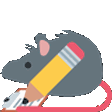

<!-- pause -->

_しかし、ここで終わりではありません_

<!-- end_slide -->

<!-- alignment: center -->


`スズキ バレーノ`でRatatui  
[](https://github.com/thatdevsherry/suzui-rs)

<!-- end_slide -->

<!-- new_lines: 1 -->


<!-- alignment: center -->

`PSP`でRatatui  
`https://github.com/overdrivenpotato/rust-psp/pull/190`

<!-- end_slide -->

<!-- new_lines: 1 -->

名前を付けると：

<!-- pause -->

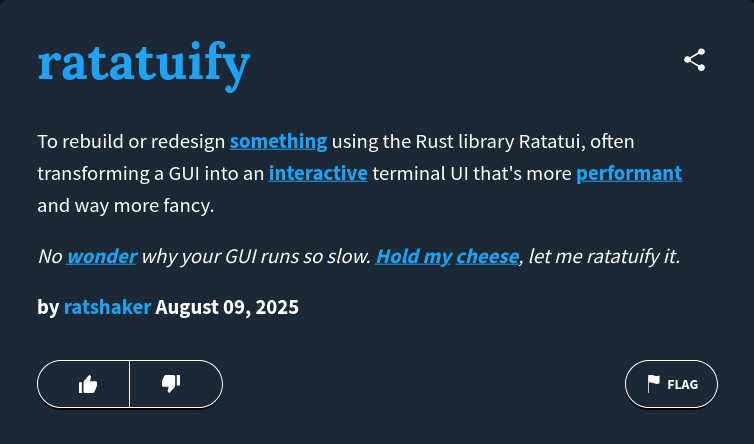

<!-- alignment: center -->

_https://www.urbandictionary.com/define.php?term=ratatuify_

<!-- pause -->

_でも、どうやって可能なの？_ 🤔

<!-- end_slide -->

### impl Backend

```rust
pub trait Backend {
    fn draw<'a, I>(&mut self, content: I) -> Result<()>
       where I: Iterator<Item = (u16, u16, &'a Cell)>;
    fn hide_cursor(&mut self) -> Result<()>;
    fn show_cursor(&mut self) -> Result<()>;
    fn get_cursor_position(&mut self) -> Result<Position>;
    fn set_cursor_position<P: Into<Position>>(
        &mut self,
        position: P,
    ) -> Result<()>;
    fn clear(&mut self) -> Result<()>;
    fn size(&self) -> Result<Size>;
    fn window_size(&mut self) -> Result<WindowSize>;
    fn flush(&mut self) -> Result<()>;
    // ...
}
```

<!-- end_slide -->

### カスタムバックエンド

| リポジトリ | 説明 |
| ----------------------------------- | -------------------------------------- |
| _reubeno_/`ratatui-uefi`            | UEFI                                   |
| _j-g00da_/`mousefood`               | embedded-graphicsバックエンド          |
| _Jesterhearts_/`ratatui-wgpu`       | GPU加速レンダリング                    |
| _gold-silver-copper_/`egui_ratatui` | EGUIウィジェット                       |
| _gold-silver-copper_/`soft_ratatui` | 純粋なソフトウェアレンダリング         |
| _cxreiff_/`bevy_ratatui_camera`     | Bevyアプリをターミナルにレンダリング   |
| _orhun_/`ratzilla`                  | Web                                    |


<!-- new_lines: 1 -->

<!-- end_slide -->

#### 例：Ratzilla

RustとWebAssemblyでターミナルテーマのWebアプリケーションを構築

サポート：

- `CanvasBackend`
- `DomBackend`
- `WebGl2Backend`

---

<!-- pause -->

```bash +exec
handlr open https://orhun.dev/ratzilla/demo/
```

<!-- end_slide -->

今日は次についてお話します：

<!-- pause -->

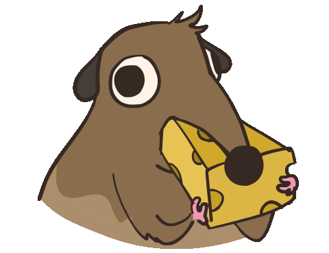

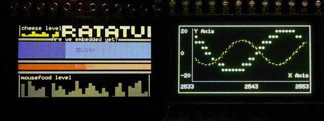

<!--alignment: center-->

_mousefood_！

<!-- end_slide -->

⚠️ すべてのツールがインストールされていることを確認してください：

```bash
git clone https://github.com/orhun/embedded-ratatui-workshop
```

<!-- pause -->

```bash
curl --proto '=https' --tlsv1.2 -sSf https://sh.rustup.rs | sh

source $HOME/.cargo/env

cargo install espup
espup install

. ~/export-esp.sh

cargo install espflash ldproxy
```

<!-- end_slide -->

# ハードウェアを知ろう！

**ESP32 T-Display**

| 機能               | 仕様                                 |
| --------------------- | --------------------------------------------- |
| MCU                   | ESP32 Xtensa デュアルコア LX6 マイクロプロセッサ     |
| CPU                   | Xtensa デュアルコア LX6 @ 最大 240 MHz          |
| RAM                   | 520 KB SRAM (ESP32標準)               |
| ワイヤレス接続 | Wi-Fi 802.11 b/g/n, BL V4.2 + BLE             |
| シリアルチップ           | CH9102                                        |
| オプション              | フラッシュ：4M / 16M                               |
| オンボード機能     | ボタン：l006 + I007、バッテリー電力検出 |
| ディスプレイ               | 1.14" 135x240px IPS LCD、ST7789V コントローラー   |

<!-- column_layout: [1, 1, 1]-->

<!-- column: 0 -->

<!-- new_lines:  2-->

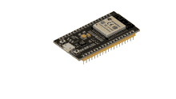

<!-- column: 1 -->

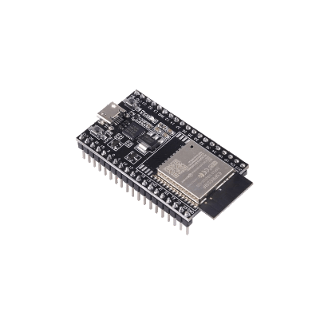

<!-- column: 2 -->

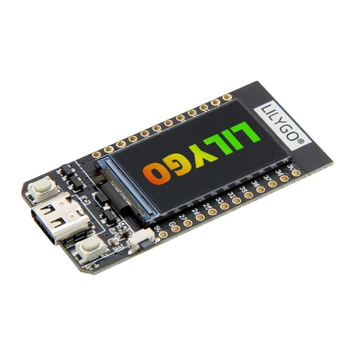

<!-- end_slide -->

# フレームワーク

<!-- column_layout: [1, 1] -->
<!-- column: 0 -->

## **esp-hal**

- ベアメタル（`#![no_std]`）
- Espressifが資金提供

<!-- column: 1 -->

## **esp-idf-hal**

- `std`サポート付き！
- コミュニティの取り組み
- カスタムツールチェーンが必要

<!-- reset_layout -->

<!-- column_layout: [2, 3] -->
<!-- column: 0 -->

<!-- pause -->

## ツールチェーン

```sh
cargo install espup
espup install
```

```sh
cargo install espflash
```

<!-- column: 1 -->

<!-- pause -->

`.cargo/config.toml`:

```toml
[build]
target = "xtensa-esp32-espidf"

[target.xtensa-esp32-espidf]
linker = "ldproxy"
runner = "espflash flash --monitor"
rustflags = [ "--cfg",  "espidf_time64"]
```

<!-- end_slide -->

### Ratatui + embedded-graphics = **Mousefood**

<!-- column_layout: [4, 3] -->

<!-- column: 0 -->

- `embedded-graphics`上に構築
- カスタムビットマップフォントサポート

<!-- column: 1 -->


<!-- reset_layout -->

```rust {1-9|2|4|5|7-9|1-9}
// あらゆるembedded_graphics DrawTarget
let mut display = MyDrawTarget::new();

let backend = EmbeddedBackend::new(&mut display, EmbeddedBackendConfig::default());
let mut terminal = Terminal::new(backend)?;

loop {
    terminal.draw(...)?;
}
```

<!-- alignment: center -->

`https://github.com/j-g00da/mousefood`

<!-- end_slide -->

<!-- alignment: center -->

試してみてください：

```bash
cd template
cargo run --release
```

または：

```bash
espflash flash --monitor apps/binaries/mousefood-demo.bin
```


<!-- end_slide -->

### シミュレーター 🤖

```rust {1-15|1-8|10|12-13|15|1-15}
let mut simulator_window = Window::new(
    "mousefood simulator",
    &OutputSettings {
        scale: 4,
        max_fps: 30,
        ..Default::default()
    },
);

let mut display = SimulatorDisplay::new(Size::new(128, 64));

let config = EmbeddedBackendConfig::default();
let backend = EmbeddedBackend::new(&mut display, config);

let mut terminal = Terminal::new(backend)?;
```

<!-- alignment: center -->

これでシミュレーターバックエンドでRatatuiを起動

<!-- end_slide -->

<!-- alignment: center -->

シミュレーターを実行：

```bash
cd apps/simulator
cargo run
```

（SDL2が必要）


<!-- end_slide -->

# では、何ができるでしょうか？

<!-- pause -->

ギターを学ぼう！

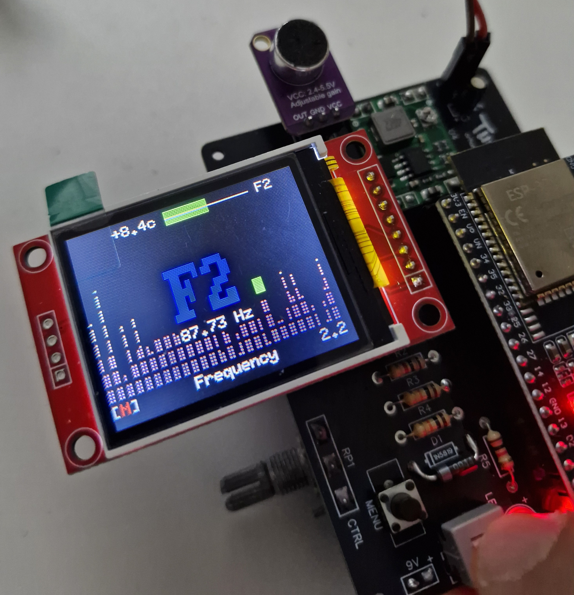

<!-- alignment: center -->

| _Rust、Ratatui、そして9Vバッテリーで動作！_

<!-- end_slide -->

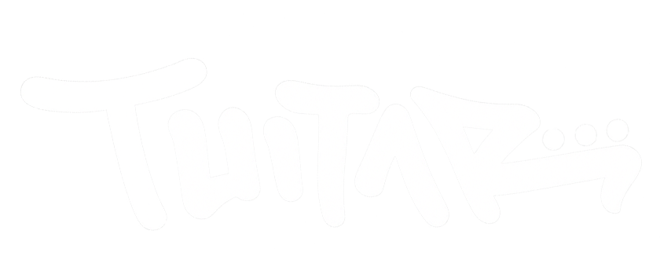

<!-- alignment: center -->

「_ポータブルでターミナルベースのギター訓練ツール_」


```sh +exec
mpv /home/orhun/downloads/tuitar-final.mp4
```

<!-- end_slide -->

<!-- new_lines: 1 -->

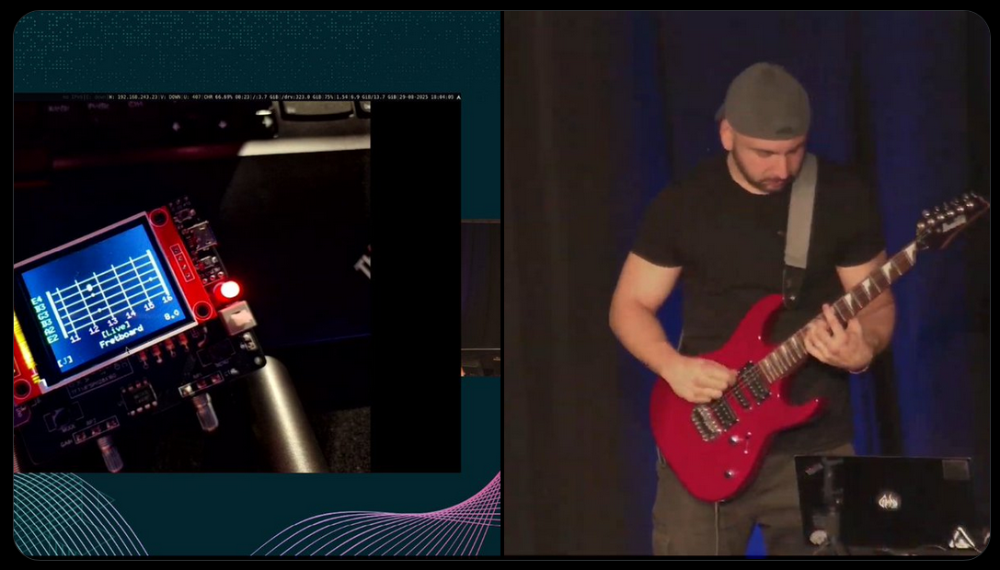

<!-- alignment: center -->

[](https://www.youtube.com/live/es48dmNWMVQ)

Rust Forgeでのライブデモ！

<!-- end_slide -->

<!-- column_layout: [5, 8] -->

<!-- column: 0 -->

### impl Widget

```rust
pub struct Fretboard {
    tuning: Vec<Note>,
    style: Style,
}
```

```rust
pub struct FretboardState {
    notes: Vec<Note>
}
```


<!-- column: 1 -->

```rust
impl StatefulWidget for &Fretboard {
    type State = FretboardState;

    fn render(
        self,
        area: Rect,
        buf: &mut Buffer,
        state: &mut Self::State,
    ) {
        for s in self.tuning.iter() {
            // ...
            buf.set_line(
                area.x,
                area.y + i as u16,
                &Line::from(spans),
                area.width,
            );
        }
    }
}
```

<!-- end_slide -->

## `ratatui-fretboard`ウィジェットの紹介 🎉

```rust
let fretboard = Fretboard::default();
let mut state = FretboardState::default();
state.set_active_note(Note::A(4));
frame.render_stateful_widget(fretboard, area, &mut state);
```

```
E4 ║─┼───┼───┼───┼───┼─⬤─┼───┼───┼───┼───┼───┼───║
B3 ║─┼───┼───┼───┼───┼───┼───┼───┼───┼───┼─⬤─┼───║
G3 ║─┼───┼───┼───┼───┼───┼───┼───┼───┼───┼───┼───║
D3 ║─┼───┼───┼─•─┼───┼─•─┼───┼─•─┼───┼─•─┼───┼───║
A2 ║─┼───┼───┼───┼───┼───┼───┼───┼───┼───┼───┼───║
E2 ║─┼───┼───┼───┼───┼───┼───┼───┼───┼───┼───┼───║
     1   2   3   4   5   6   7   8   9  10  11  12
```

<!-- alignment: center -->

文字列名、フレット、色など、すべてカスタマイズ可能です。

<!-- end_slide -->

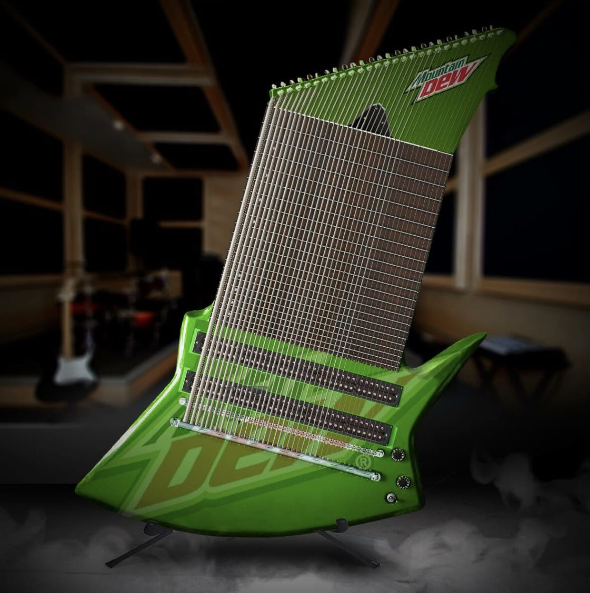

<!-- end_slide -->

```
D0 ║─┼───┼───┼─⬤─┼───┼─⬤─┼───┼───┼───┼─⬤─┼───┼───┼───┼───║
G0 ║─┼───┼───┼───┼─⬤─┼───┼───┼───┼───┼─⬤─┼───┼───┼───┼───║
C0 ║─┼───┼─⬤─┼───┼───┼─⬤─┼───┼─⬤─┼───┼───┼───┼─⬤─┼───┼───║
F0 ║─┼───┼─⬤─┼───┼───┼───┼─⬤─┼───┼───┼───┼───┼─⬤─┼───┼───║
B0 ║─┼───┼───┼───┼───┼─⬤─┼───┼───┼───┼───┼─⬤─┼───┼─•─┼───║
E1 ║─┼───┼───┼─•─┼───┼─⬤─┼───┼─•─┼───┼─•─┼─⬤─┼───┼───┼───║
A1 ║─┼───┼───┼───┼───┼─⬤─┼───┼───┼───┼───┼─⬤─┼───┼─•─┼───║
D2 ║─┼───┼───┼───┼───┼─⬤─┼───┼───┼───┼─✖─┼─⬤─┼───┼─✖─┼───║
G2 ║─┼───┼───┼───┼─✖─┼─⬤─┼───┼─✖─┼───┼───┼───┼───┼───┼───║
C3 ║─┼───┼─✖─┼───┼───┼───┼───┼───┼───┼─✖─┼───┼───┼───┼───║
     1   2   3   4   5   6   7   8   9  10  11  12  13  14
```


<!-- end_slide -->

## TUItar

```sh +exec +acquire_terminal
tuitar
```

<!-- alignment: center -->

[](https://github.com/orhun/tuitar)

<!-- end_slide -->

<!-- alignment: center -->

<!-- new_lines: 3 -->

もっと見る？


_口で言うのは簡単、チーズを見せて。_

<!-- end_slide -->

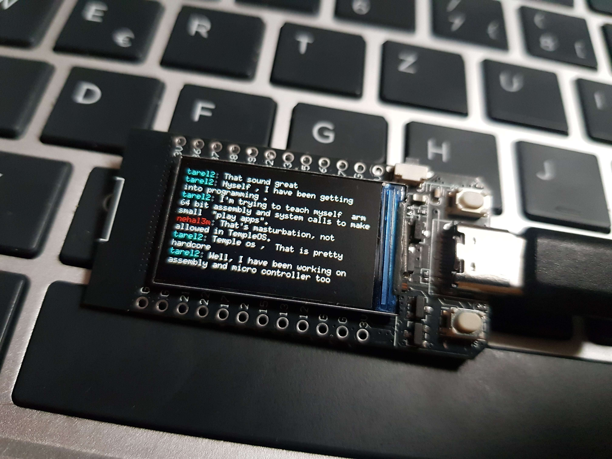

<!-- alignment: center -->

[](https://github.com/intuis/mnyaoo32)

<!-- end_slide -->

<!-- column_layout: [1, 4, 4, 1] -->

<!-- column: 1 -->


<!-- column: 2 -->

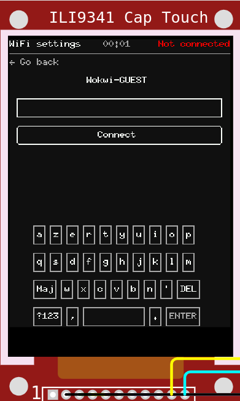

<!-- reset_layout -->

<!-- alignment: center -->

[](https://github.com/Julien-cpsn/Phone-OS)

<!-- end_slide -->

### アニメーション


<!-- alignment: center -->

[](https://github.com/junkdog/tachyonfx)経由

<!-- end_slide -->

<!-- new_lines: 3 -->

<!-- alignment: center -->

アイデアが掴めたと思います...

<!-- pause -->

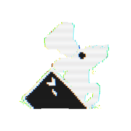

ワークショップの時間です！

<!-- no_footer -->

<!-- end_slide -->

<!-- new_lines: 2 -->

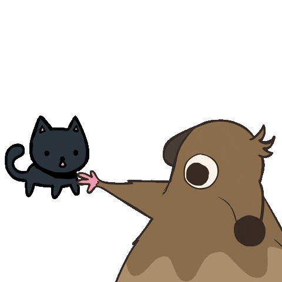

<!-- no_footer -->

<!-- end_slide -->

## キッチンのセットアップを確認

```bash
git clone https://github.com/orhun/embedded-ratatui-workshop
```

料理を始める前にツールが動作することを確認してください！

```bash
cd template
cargo run --release
```

<!-- alignment: center -->

✅ 画面に「Ratatui on embedded devices!」と表示されること

⚠️ 表示されない場合は、トラブルシューティングセクションを確認するか、シェフに助けを求めてください。

<!-- end_slide -->

```
.
├── build.rs             -> ビルドスクリプト
├── .cargo
│   └── config.toml      -> ESP32用のCargo設定
├── Cargo.toml           -> 依存関係とメタデータ
├── rust-toolchain.toml  -> Rustツールチェーンの指定
├── sdkconfig.defaults   -> ESP-IDF設定
└── src
    ├── button.rs        -> ボタン処理モジュール
    ├── lib.rs           -> モジュール定義
    ├── main.rs          -> メインアプリケーション
    └── setup.rs         -> セットアップと初期化コード
```

<!-- pause -->

<!-- alignment: center -->

主に`src/main.rs`で作業します。

<!-- pause -->

アプリケーションのライフサイクル用の`App`トレイトの実装が含まれています。

<!-- end_slide -->

## 独自のフレーバーを追加

- `App::draw()`メソッドを編集してください。

- 以下のいずれかを試してください：

  - テキストを変更
  - 色や枠線を追加
  - レイアウトを試す
  - 異なるウィジェットをレンダリング

🎨 最小限のウィジェット例：`https://github.com/ratatui/ratatui/tree/main/ratatui-widgets/examples`

📚 ウィジェットのドキュメント：`https://docs.rs/ratatui/latest/ratatui/widgets/index.html`

---

再フラッシュするには：`cargo run --release`

<!-- end_slide -->

## 独自の料理を作ろう！

基本をマスターしたので、何か楽しいものを作りましょう！

🧠 いくつかのアイデア：

- たまごっち（ラタごっち？）
- タイマー / ポモドーロ
- デジタルおみくじクッキー
- 反応ゲーム（モグラ叩きのような）
- ミニゲーム（スネークやテトリスのような）
- ASCIIピクセルアート（`Widget`トレイトを調べる）

<!-- pause -->

---

🧀 発表と共有！

<!-- end_slide -->

<!-- alignment: center -->

# ありがとうございました、小さなシェフたち！🐀

_ありがとうございました_

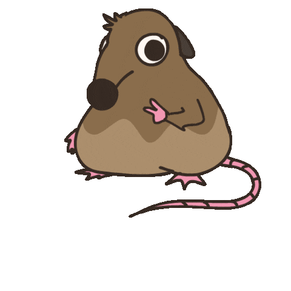

覚えておいてください：  
_「誰でも料理できる — そして誰でもTUIを作れます。」_

<!-- end_slide -->

<!-- alignment: center -->

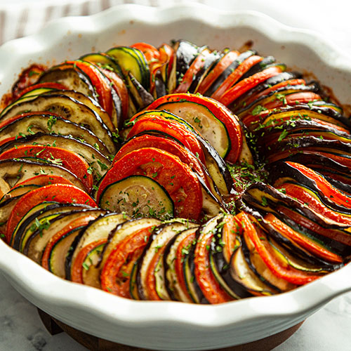

<!-- new_lines: 1 -->

🐭 **スライド：** [](https://github.com/orhun/embedded-ratatui-talk)  
🧀 **スポンサー：** [](https://github.com/sponsors/orhun)  
📺 **もっとネズミを見る：** [](https://youtube.com/@orhundev)

✨ 次のワークショップでお会いしましょう — そして料理を続けてください。

`P.S. 私の帽子の下にネズミが隠れていません。`
